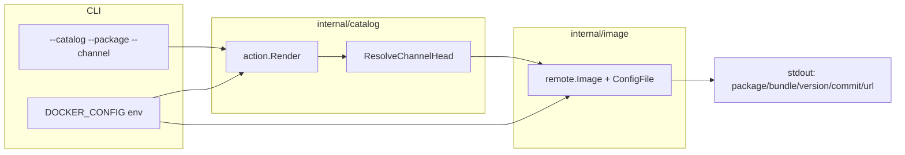
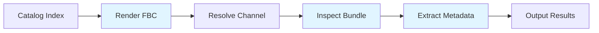

# OPM Troubleshooting Plugin

Claude Code plugin for OLM catalog bundle inspection and operator troubleshooting with pure Go implementation.

## Overview

The `opm-troubleshooting` plugin provides AI-powered commands for diagnosing OLM (Operator Lifecycle Manager) operator issues in OpenShift environments. It replaces traditional shell toolchains (`opm render` + `jq` + `skopeo`) with a pure Go implementation that integrates seamlessly with Claude Code workflows.

**Key Features**:
- 🔍 **Bundle Inspection**: Resolve channel-head bundles and extract commit metadata
- 📊 **Batch Validation**: Validate 100+ operators efficiently with single catalog render
- 🔧 **Channel Resolution**: Discover available channels and upgrade paths
- 🤖 **AI Agents**: Automated troubleshooting workflows with intelligent diagnosis
- 🚀 **Pure Go**: No external dependencies on `opm`, `jq`, or `skopeo` binaries

## Architecture


## Installation

### Prerequisites

1. **Claude Code CLI** installed (v0.1.0+)
2. **Network access** to pull OCI images (catalog indexes and bundles)
3. **Registry credentials** (for private catalogs): Set `DOCKER_CONFIG` environment variable

### Add Plugin Marketplace

```bash
# Add the ai-helpers marketplace (if not already added)
/plugin marketplace add midu16/ai-helpers

# Install the opm-troubleshooting plugin
/plugin install opm-troubleshooting@ai-helpers
```

### Verify Installation

```bash
# List available commands
/plugin list

# Should show:
# - opm-troubleshooting:inspect-bundle
# - opm-troubleshooting:resolve-channel
# - opm-troubleshooting:batch-validate
```

## Quick Start

### Example 1: Inspect an Operator Bundle

```bash
/opm-troubleshooting:inspect-bundle \
  --catalog quay.io/prega/prega-operator-index:v4.22-latest \
  --package kubernetes-nmstate-operator \
  --channel stable
```

**Output**:
```
package: kubernetes-nmstate-operator
bundle:  registry.redhat.io/openshift4/kubernetes-nmstate-operator-bundle@sha256:abc123...
version: v4.22.0-202606071943
commit:  a1b2c3d4e5f6g7h8i9j0k1l2m3n4o5p6q7r8s9t0
url:     https://github.com/nmstate/kubernetes-nmstate/commit/a1b2c3d4e5f6g7h8i9j0k1l2m3n4o5p6q7r8s9t0
```

### Example 2: List Available Channels

```bash
/opm-troubleshooting:resolve-channel \
  --catalog registry.redhat.io/redhat/redhat-operator-index:v4.22 \
  --package odf-operator
```

**Output**:
```
package: odf-operator
defaultChannel: stable-4.22

Available channels:
- stable-4.21 (15 bundles)
- stable-4.22 (8 bundles)
```

### Example 3: Batch Validate Operators

Create `operators.txt`:
```
odf-operator stable-4.22
kubernetes-nmstate-operator stable
cluster-logging stable-5.9
```

Run validation:
```bash
/opm-troubleshooting:batch-validate \
  --catalog registry.redhat.io/redhat/redhat-operator-index:v4.22 \
  --list operators.txt
```

**Output**:
```
OK     odf-operator                    stable-4.22    version=v4.22.5 commit=5d1e5bd5
PARTIAL kubernetes-nmstate-operator   stable         version=v4.22.0 commit="" url=""
OK     cluster-logging                 stable-5.9     version=v5.9.8 commit=def67890

Total: 2 OK, 1 PARTIAL, 0 FAIL
```

## Commands

### `inspect-bundle`

Inspect OLM catalog bundle metadata and resolve channel head bundles.

**Synopsis**:
```bash
/opm-troubleshooting:inspect-bundle \
  --catalog <catalog-image> \
  --package <package-name> \
  [--channel <channel-name>] \
  [--version <version>] \
  [--json]
```

**Use Cases**:
- Identify which bundle version is deployed on a channel
- Extract source code commit SHA from bundle image
- Find repository URL for filing issues or reviewing code
- Debug OLM installation issues

**See**: [commands/inspect-bundle.md](commands/inspect-bundle.md)

### `resolve-channel`

Resolve OLM package channels and discover available upgrade paths.

**Synopsis**:
```bash
/opm-troubleshooting:resolve-channel \
  --catalog <catalog-image> \
  --package <package-name> \
  [--detailed]
```

**Use Cases**:
- Verify channel exists before creating Subscription
- Understand available upgrade paths between versions
- Identify bundles when migrating channels
- Debug "channel not found" errors

**See**: [commands/resolve-channel.md](commands/resolve-channel.md)

### `batch-validate`

Batch validate multiple OLM operators from a catalog index.

**Synopsis**:
```bash
/opm-troubleshooting:batch-validate \
  --catalog <catalog-image> \
  --list <operator-list-file> \
  [--timeout <duration>]
```

**Use Cases**:
- Validate catalog builds before release
- Ensure operator bundles meet metadata requirements
- Detect missing metadata or broken bundle images
- Compare catalog quality across versions

**See**: [commands/batch-validate.md](commands/batch-validate.md)

## AI Agents

The plugin includes specialized AI agents for automated troubleshooting workflows. See [agents/AGENTS.md](agents/AGENTS.md) for details.

Available agents:
- **Bundle Metadata Analyzer**: Diagnose missing commit SHA or repository URLs
- **Channel Migration Assistant**: Guide users through channel upgrades
- **Catalog Quality Auditor**: Audit entire catalogs for metadata quality
- **Subscription Troubleshooter**: Debug OLM Subscription failures
- **Version Resolver**: Find which bundle contains a specific commit

## Implementation

### Pure Go Implementation

The plugin uses native Go libraries instead of external binaries:

| Traditional Toolchain | This Plugin |
|-----------------------|-------------|
| `opm render <catalog>` | `operator-registry/alpha/action.Render` |
| `jq` on FBC JSON | `declcfg.DeclarativeConfig` in-memory |
| `skopeo inspect <bundle>` | `go-containerregistry/pkg/v1/remote` |
| CSV parsing with shell scripts | `internal/bundlecsv` tar layer parsing |

**Benefits**:
- ✅ No external dependencies to install
- ✅ Faster execution (in-memory processing)
- ✅ Better error handling and reporting
- ✅ Testable with Go unit tests

### Workflow Pipeline



1. **Render**: Pull catalog index and parse FBC (File-Based Catalog)
2. **Resolve**: Navigate declarative config to find channel and bundle
3. **Inspect**: Pull bundle image config and extract labels
4. **Extract**: Parse commit SHA, repository URL, version from labels/CSV
5. **Output**: Return structured metadata to Claude Code

## Configuration

### Registry Authentication

For private catalogs or bundles, configure registry credentials:

```bash
# Set DOCKER_CONFIG to directory containing config.json
export DOCKER_CONFIG=/path/to/docker-config

# Alternative: use REGISTRY_AUTH_FILE
export REGISTRY_AUTH_FILE=/path/to/auth.json
```

**Example** `~/.docker/config.json`:
```json
{
  "auths": {
    "quay.io": {
      "auth": "base64-encoded-credentials"
    },
    "registry.redhat.io": {
      "auth": "base64-encoded-credentials"
    }
  }
}
```

### Build Dependencies

The plugin uses a pure Go build tag to avoid the `gpgme` C library dependency:

```bash
# Build uses containers_image_openpgp tag (no gpgme needed)
make build
```

If you encounter build errors related to `gpgme`, install the development library:

```bash
# Ubuntu/Debian
sudo apt-get install libgpgme-dev

# Fedora/RHEL
sudo dnf install gpgme-devel

# macOS
brew install gpgme
```

### Timeout Configuration

For large catalogs or slow network connections:

```bash
# Increase timeout to 30 minutes
/opm-troubleshooting:batch-validate \
  --catalog ... \
  --list operators.txt \
  --timeout 30m
```

## Troubleshooting

### Common Issues

#### 1. Catalog Render Fails

**Error**: `render catalog "quay.io/...": unauthorized`

**Fix**: Set registry credentials
```bash
export DOCKER_CONFIG=/path/to/docker-config
```

#### 2. Channel Not Found

**Error**: `channel "stable" not found for package "cluster-logging"`

**Fix**: List available channels
```bash
/opm-troubleshooting:resolve-channel \
  --catalog ... \
  --package cluster-logging
```

#### 3. Bundle Image Pull Fails

**Error**: `pull image "registry.redhat.io/...": manifest unknown`

**Diagnosis**: Bundle image might be deleted or unreachable

**Fix**: Check bundle image exists with `skopeo inspect` or verify catalog is up-to-date

#### 4. Missing Commit or URL (PARTIAL Status)

**Symptom**: Bundle validates but shows `commit=""` or `url=""`

**Cause**: Bundle image lacks Git metadata labels

**Fix**: See [agents/AGENTS.md](agents/AGENTS.md) for Bundle Metadata Analyzer agent

## Development

### Building the Plugin

The plugin is built on the existing Go codebase in this repository:

```bash
# Build the CLI binary
make build

# Binary location
bin/catalog-bundle-inspect

# Run tests
make test

# Run integration tests (requires DOCKER_CONFIG)
export RUN_INTEGRATION_TESTS=1
export DOCKER_CONFIG=/path/to/config
make test-integration
```

### Plugin Structure

```
opm-troubleshooting/
├── .claude-plugin/
│   └── plugin.json              # Plugin metadata
├── commands/
│   ├── inspect-bundle.md        # Command: inspect-bundle
│   ├── resolve-channel.md       # Command: resolve-channel
│   └── batch-validate.md        # Command: batch-validate
├── agents/
│   └── AGENTS.md                # AI agent workflows
├── bin/
│   └── catalog-bundle-inspect   # Go binary
├── cmd/
│   ├── catalog-bundle-inspect/  # CLI entrypoint
│   └── batch-validate/          # Batch validation tool
├── internal/
│   ├── catalog/                 # FBC rendering and resolution
│   ├── imageinspect/            # Bundle image inspection
│   ├── bundlecsv/               # CSV parsing
│   └── workflow/                # End-to-end pipeline
└── README.md                    # This file
```

### Testing

```bash
# Unit tests
make test

# Integration tests (requires network and credentials)
export RUN_INTEGRATION_TESTS=1
export DOCKER_CONFIG=/home/midu/prega
make test-integration

# Functional tests
make test-functional

# Coverage report
make coverage
```

### Contributing

1. Add new commands to `commands/` following the [ai-helpers command structure](https://github.com/midu16/ai-helpers/blob/main/AGENTS.md)
2. Ensure commands involve AI reasoning, not just script wrappers
3. Update `plugin.json` version for functional changes
4. Add agent workflows to `agents/AGENTS.md` if applicable
5. Run `make lint` before committing

## Use Cases

### 1. Subscription Debugging

**Scenario**: OLM Subscription fails with "channel not found" error

**Workflow**:
```bash
# Extract catalog, package, channel from Subscription
# Then resolve available channels
/opm-troubleshooting:resolve-channel \
  --catalog registry.redhat.io/redhat/redhat-operator-index:v4.22 \
  --package cluster-logging

# Output shows: available channels: stable-5.9, stable-6.0 (not "stable")
# Fix: Update Subscription channel to stable-5.9
```

### 2. Catalog Release Validation

**Scenario**: Validate 125 Red Hat operators before releasing catalog

**Workflow**:
```bash
# Create operator list
cat > operators-v4.22.txt <<EOF
odf-operator stable-4.22
advanced-cluster-management release-2.11
kubernetes-nmstate-operator stable
# ... 122 more operators
EOF

# Batch validate
/opm-troubleshooting:batch-validate \
  --catalog quay.io/prega/prega-operator-index:v4.22-20260607 \
  --list operators-v4.22.txt > validation-report.txt

# Review failures
grep FAIL validation-report.txt
```

### 3. Bundle Metadata Audit

**Scenario**: Ensure all operator bundles have commit SHA and repository URL

**Workflow**:
```bash
# Run batch validation
/opm-troubleshooting:batch-validate \
  --catalog quay.io/prega/prega-operator-index:v4.22-latest \
  --list all-operators.txt

# Filter for PARTIAL status (missing metadata)
grep PARTIAL validation-report.txt

# For each PARTIAL operator, inspect individually
/opm-troubleshooting:inspect-bundle \
  --catalog ... \
  --package <operator-name> \
  --json

# Use AI agent to suggest Dockerfile LABEL fixes
# (See agents/AGENTS.md - Bundle Metadata Analyzer)
```

### 4. Channel Migration Planning

**Scenario**: Migrate ODF operator from stable-4.21 to stable-4.22

**Workflow**:
```bash
# Inspect current channel
/opm-troubleshooting:inspect-bundle \
  --catalog quay.io/prega/prega-operator-index:v4.22-latest \
  --package odf-operator \
  --channel stable-4.21

# Inspect target channel
/opm-troubleshooting:inspect-bundle \
  --catalog quay.io/prega/prega-operator-index:v4.22-latest \
  --package odf-operator \
  --channel stable-4.22

# Compare versions and commit URLs
# Review commit history on GitHub for breaking changes
# Update Subscription spec.channel
```

## Performance

### Benchmarks

**Single Bundle Inspection**:
- Catalog render: ~60-90 seconds (large catalog, first time)
- Channel resolution: <1 second (in-memory)
- Bundle inspection: ~3-5 seconds (network + image pull)
- **Total**: ~65-95 seconds

**Batch Validation (125 operators)**:
- Catalog render: ~60-90 seconds (once)
- 125 bundle inspections: ~6-10 minutes (parallel)
- **Total**: ~8-12 minutes

**Optimization Notes**:
- Catalog is rendered **once** and reused for batch operations
- Bundle inspections can be parallelized (future enhancement)
- Registry credentials cached via `DOCKER_CONFIG` reduce auth overhead

## License

Apache 2.0 (inherits from repository license)

## References

- [Operator Lifecycle Manager Documentation](https://olm.operatorframework.io/)
- [File-Based Catalog (FBC) Specification](https://olm.operatorframework.io/docs/reference/file-based-catalogs/)
- [operator-registry Go Library](https://github.com/operator-framework/operator-registry)
- [go-containerregistry](https://github.com/google/go-containerregistry)
- [Claude Code Documentation](https://docs.anthropic.com/claude/docs)

## Support

For issues or feature requests:
1. Check existing commands with `/plugin list`
2. Review agent workflows in [agents/AGENTS.md](agents/AGENTS.md)
3. File issues at the ai-helpers repository
4. Use Claude Code for interactive troubleshooting with AI assistance

---

**Version**: 1.0.0  
**Author**: github.com/openshift-eng  
**Plugin Type**: Operator Troubleshooting & Catalog Inspection
