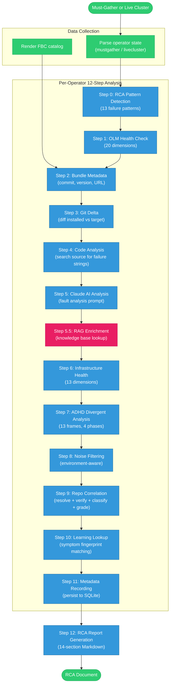
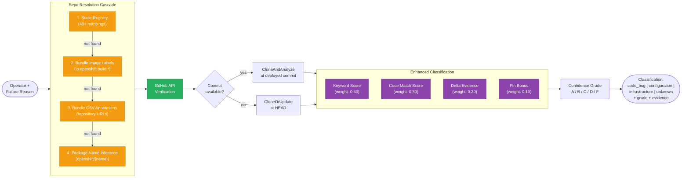
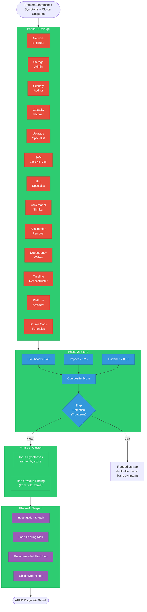
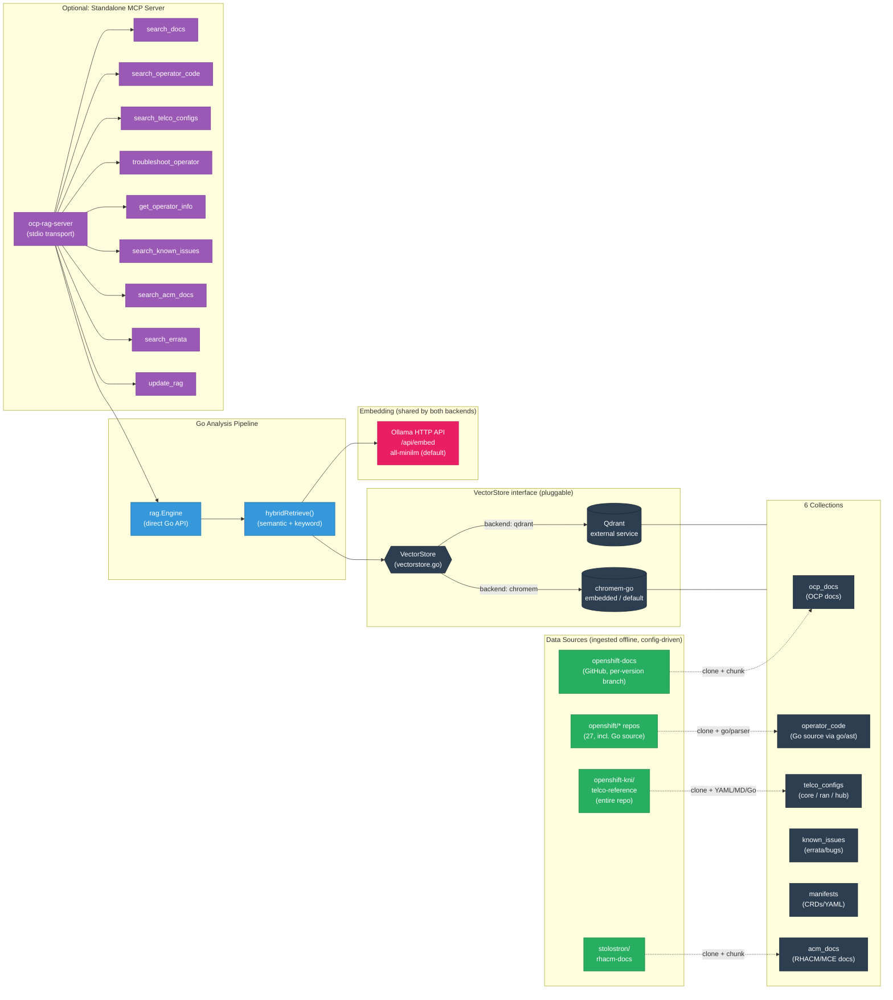
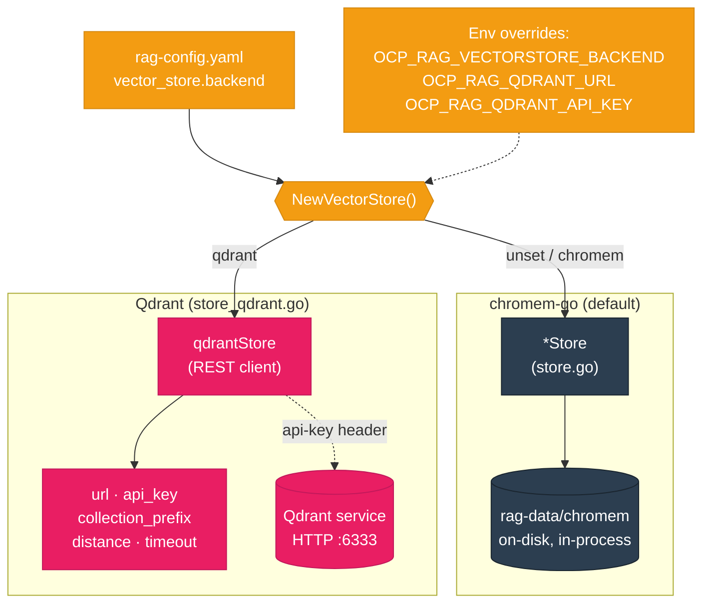
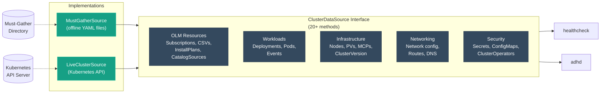
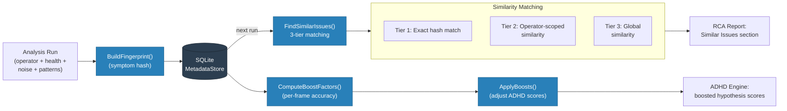
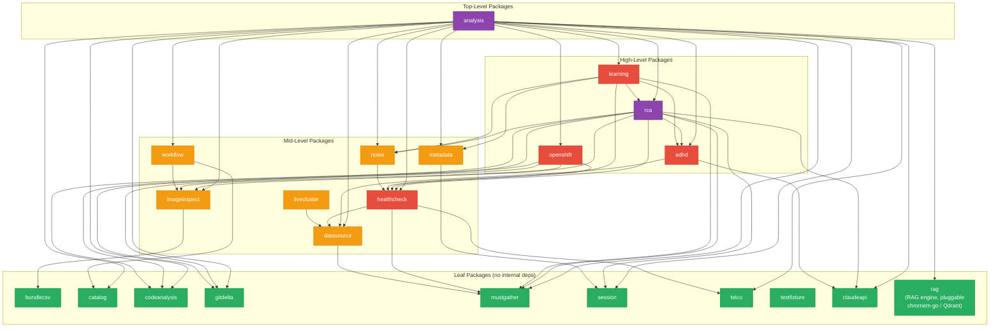

# Software Architecture

## System Overview

```mermaid
graph TB
    subgraph Binaries["CLI Binaries"]
        OPM[opm-diagnose]
        CBI[catalog-bundle-inspect]
        TD[telco-diagnose]
        BV[batch-validate]
        RAGS[ocp-rag-server]
        RAGI[ocp-rag-ingest]
    end

    subgraph CLI["CLI Layer"]
        RunDiagnose["cli.RunDiagnose()"]
        Run["cli.Run()"]
        RunTelco["cli.RunTelcoDiagnose()"]
    end

    OPM --> RunDiagnose
    CBI --> Run
    TD --> RunTelco
    BV --> WF

    RunDiagnose --> AN
    Run --> AN
    Run --> WF
    RunTelco --> AN

    subgraph Input["Data Input Layer"]
        MG["mustgather\n(YAML parser)"]
        DS["datasource\n(ClusterDataSource\ninterface)"]
        LC["livecluster\n(Kubernetes API)"]
    end

    DS --- MG
    LC --> DS

    subgraph OLM["OLM Catalog & Bundle Layer"]
        CAT["catalog\n(FBC render +\nchannel resolution)"]
        WF["workflow\n(inspect pipeline)"]
        II["imageinspect\n(image label\nextraction)"]
        CSV["bundlecsv\n(CSV annotation\nparsing)"]
    end

    WF --> CAT
    WF --> II
    II --> CSV

    subgraph AI["AI & Analysis Layer"]
        CL["claudeapi\n(Anthropic API)"]
        ADHD["adhd\n(13-frame divergent\nanalysis engine)"]
        RAG["rag.Engine\n(Go RAG, pluggable\nchromem-go / Qdrant)"]
    end

    ADHD --> CL

    subgraph Health["Health Check & Noise Layer"]
        HC["healthcheck\n(20 OLM + 13 infra\ndimensions)"]
        NF["noise\n(environment-aware\nfiltering)"]
    end

    NF --> HC

    subgraph SCC["Source Code Correlation Layer"]
        OS["openshift\n(repo resolver +\nclassifier + grading)"]
        GD["gitdelta\n(commit diff)"]
        CA["codeanalysis\n(pattern search)"]
    end

    OS --> CA
    OS --> GD
    OS --> II

    subgraph Output["Output & Reporting Layer"]
        RCA["rca\n(14-section Markdown\nRCA report)"]
    end

    subgraph Persist["Persistence & Learning Layer"]
        SS["session\n(JSON on disk)"]
        MD["metadata\n(SQLite store)"]
        LN["learning\n(symptom matching +\nframe boost)"]
    end

    MD --> SS
    LN --> MD

    subgraph Domain["Domain Configuration"]
        TL["telco\n(27 operator profiles)"]
    end

    subgraph Core["Central Orchestrator"]
        AN["analysis\n(12-step pipeline)"]
    end

    AN --> MG
    AN --> DS
    AN --> CAT
    AN --> II
    AN --> WF
    AN --> CL
    AN --> ADHD
    AN --> HC
    AN --> NF
    AN --> OS
    AN --> GD
    AN --> CA
    AN --> RCA
    AN --> SS
    AN --> MD
    AN --> LN
    AN --> TL
    AN --> RAG

    RCA --> ADHD
    RCA --> HC
    RCA --> NF
    RCA --> SS

    HC --> DS
    HC --> TL

    ADHD --> DS

    LN --> ADHD
    LN --> HC

    subgraph RAGStore["RAG Vector Store (pluggable backend)"]
        VS{{"VectorStore interface\n(vectorstore.go)"}}
        CHROMEM[("chromem-go\nembedded / default")]
        QD[("Qdrant\nexternal service")]
        VS --> CHROMEM
        VS --> QD
        C1["ocp_docs"]
        C2["operator_code"]
        C3["telco_configs"]
        C4["known_issues"]
        C5["manifests"]
        C6["acm_docs"]
        CHROMEM --- C1
        CHROMEM --- C2
        CHROMEM --- C3
        CHROMEM --- C4
        CHROMEM --- C5
        CHROMEM --- C6
    end

    RAG --> VS

    subgraph External["External Systems"]
        K8S[("Kubernetes\nAPI Server")]
        REG[("Container\nRegistries")]
        GH[("GitHub\nAPI")]
        GIT[("Git Repos\n(clone)")]
        ANTH[("Anthropic\nClaude API")]
        SQL[("SQLite\nDatabase")]
        RHDOCS[("GitHub\ndoc + telco +\nACM repos")]
        OLLAMA[("Ollama\nEmbeddings")]
        QDRANT[("Qdrant\nService")]
    end

    LC -.-> K8S
    II -.-> REG
    CAT -.-> REG
    CSV -.-> REG
    OS -.-> GH
    OS -.-> GIT
    GD -.-> GIT
    CA -.-> GIT
    CL -.-> ANTH
    MD -.-> SQL
    RAG -.-> RHDOCS
    RAG -.-> OLLAMA
    QD -.-> QDRANT

    classDef binary fill:#4a90d9,stroke:#2c5f8a,color:#fff
    classDef core fill:#e8534a,stroke:#b33c33,color:#fff
    classDef input fill:#50b848,stroke:#377d32,color:#fff
    classDef olm fill:#f5a623,stroke:#c7841a,color:#fff
    classDef ai fill:#9b59b6,stroke:#7d3c98,color:#fff
    classDef health fill:#1abc9c,stroke:#148f77,color:#fff
    classDef scc fill:#e67e22,stroke:#b8651c,color:#fff
    classDef output fill:#3498db,stroke:#2471a3,color:#fff
    classDef persist fill:#7f8c8d,stroke:#5d6d7e,color:#fff
    classDef domain fill:#95a5a6,stroke:#717d7e,color:#fff
    classDef rag fill:#e91e63,stroke:#c2185b,color:#fff
    classDef ext fill:#2c3e50,stroke:#1a252f,color:#fff

    RAGS --> RAG
    RAGI --> RAG

    class OPM,CBI,TD,BV,RAGS,RAGI binary
    class AN core
    class MG,DS,LC input
    class CAT,WF,II,CSV olm
    class CL,ADHD ai
    class HC,NF health
    class OS,GD,CA scc
    class RCA output
    class SS,MD,LN persist
    class TL domain
    class RAG,VS,CHROMEM,QD,C1,C2,C3,C4,C5,C6 rag
    class K8S,REG,GH,GIT,ANTH,SQL,RHDOCS,QDRANT ext
```

## Analysis Pipeline (12-step must-gather flow)

## Source Code Correlation Pipeline (Step 9 detail)

## ADHD Divergent Analysis Engine

## RAG Knowledge Base (Step 5.5 detail)

The RAG engine reads and writes through a `VectorStore` interface (`internal/rag/vectorstore.go`),
so the same engine, ingestion pipeline, and MCP server run unchanged against either the
embedded **chromem-go** backend (default, zero-dependency) or an external **Qdrant** service.
The backend is selected by `vector_store.backend` in `rag-config.yaml`.

All sources are config-driven: repos and docs are cloned from a configurable git host
(`openshift.git_base_url`, default `https://github.com`, overridable for GitHub Enterprise or
an internal mirror via `RepoURL()`), and the telco-reference and ACM-docs repos are each named
by slug with an `enabled` flag rather than hardcoded.

## Vector Store Backends

The pluggable backend (`internal/rag/vectorstore.go`) lets the RAG stack run either fully
self-contained or against a shared external vector database, without any change to the engine
or ingestion code.

**When to use which:**

| | chromem-go (default) | Qdrant |
|---|---|---|
| Deployment | Embedded, on-disk (`rag-data/chromem`) | External service (self-hosted or Qdrant Cloud) |
| Dependencies | None | Running Qdrant endpoint |
| Sharing | Single process | Shared across instances (via `collection_prefix`) |
| Auth | — | `api_key` header |
| Config key | `backend: chromem` | `backend: qdrant` + `vector_store.qdrant.*` |

Both backends compute embeddings locally with the same `EmbeddingFunc` (Ollama), so switching
backends does not change retrieval semantics — only where vectors are stored and searched.

## Data Source Abstraction

## Self-Learning Feedback Loop

## Package Dependency Graph

