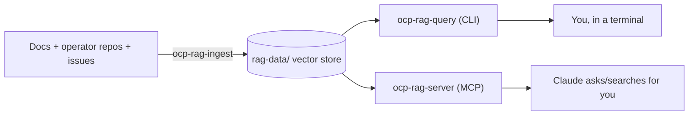

# Asking Questions and Searching the Docs

> **The question this doc answers:** *"How do I use the plugin to ask a question about
> the docs, or search the docs, or something like that?"*

Short answer: the `opm-troubleshooting` plugin ships a **RAG (Retrieval-Augmented
Generation) knowledge base**. You point it at OpenShift documentation, operator source
code, and known issues, then you ask questions in plain English — either from inside
Claude (via the `ocp-rag` MCP server) or straight from your terminal (via the
`ocp-rag-query` CLI). Both hit the same knowledge base.

This guide walks you from zero to your first answer.

---

## The 60-second version

```bash
# 1. Build the RAG binaries
make ocp-rag-server ocp-rag-ingest ocp-rag-query

# 2. Populate the knowledge base (one-time, takes several minutes)
./bin/ocp-rag-ingest --config rag-config.yaml

# 3a. Ask a question from the terminal...
./bin/ocp-rag-query --config rag-config.yaml --collection docs "SR-IOV configuration"

# 3b. ...or ask Claude directly (once the MCP server is registered)
#     "Search the OCP docs for how to configure SR-IOV networking"
```

If that's all you needed, you're done. The rest of this doc explains each piece.

---

## How it works (the mental model)

There are three moving parts:

| Piece | What it is | You use it to... |
|-------|-----------|------------------|
| **`ocp-rag-ingest`** | Ingestion CLI | Load docs, code, and issues into the knowledge base (run once, then to refresh) |
| **`ocp-rag-query`** | Query CLI | Ask questions / search from your terminal |
| **`ocp-rag-server`** | MCP server | Let **Claude** search the knowledge base for you, mid-conversation |

The knowledge base is stored locally under `rag-data/` (see `data_dir` in
`rag-config.yaml`). Embeddings are produced by the model configured under `embedding:`
in that file. **Nothing is searchable until you ingest at least once.**



---

## Step 1 — Build the binaries

```bash
# Build just the RAG tooling...
make ocp-rag-server ocp-rag-ingest ocp-rag-query

# ...or build everything
make build
```

The binaries land in `./bin/`.

## Step 2 — Configure

The knowledge base is driven by [`rag-config.yaml`](../rag-config.yaml). The defaults
work out of the box, but two things are worth a look before you ingest:

- **`embedding.url` / `embedding.model`** — the embedding backend. The default points at
  an Ollama-style endpoint (`http://bazzite:11434`, model `qwen3-embedding:latest`).
  Change these to match your environment or the ingest step will fail to connect.
- **`openshift.version` / `openshift.repos`** — which OCP version's docs and which
  operator repositories get ingested.

## Step 3 — Ingest (populate the knowledge base)

```bash
./bin/ocp-rag-ingest --config rag-config.yaml
```

This clones the configured operator repos, scrapes the OCP documentation, and builds the
local vector store. **It takes several minutes** the first time. Re-run it whenever you
want to refresh the content.

Check whether your knowledge base is up to date at any point:

```bash
./bin/ocp-rag-query --config rag-config.yaml --freshness
```

---

## Step 4a — Ask questions from the terminal (`ocp-rag-query`)

This is the most direct way to "search the docs."

```bash
# General question — searches everything and returns a troubleshooting-style answer
./bin/ocp-rag-query --config rag-config.yaml "etcd leader election timeout"

# Search a specific collection
./bin/ocp-rag-query --config rag-config.yaml --collection docs "SR-IOV configuration"

# Search operator source code, scoped to one operator
./bin/ocp-rag-query --config rag-config.yaml \
  --collection code --operator cluster-etcd-operator "reconcile loop error handling"

# Get machine-readable output for scripting
./bin/ocp-rag-query --config rag-config.yaml --collection docs --json "OADP backup failure"
```

### Flags

| Flag | Purpose |
|------|---------|
| `--config` | Path to `rag-config.yaml` (default: `rag-config.yaml`) |
| `--collection` | Which collection to search: `docs`, `code`, `telco`, `issues`, `manifests`. Omit to troubleshoot across all of them. |
| `--operator` | Scope `code`/`issues` searches (and the default troubleshoot) to one operator |
| `--json` | Emit raw JSON instead of formatted text |
| `--freshness` | Report knowledge-base freshness and exit |

### Collections at a glance

| `--collection` | What it searches |
|----------------|------------------|
| *(omitted)* | Everything — returns a combined troubleshooting result (summary, known issues, doc refs, config advice) |
| `docs` | OpenShift Container Platform documentation |
| `code` | Operator Go source code |
| `telco` | telco-reference validated configurations (telco-core / telco-ran) |
| `issues` | Known issues and bugs (use with `--operator`) |
| `manifests` | Manifest/config snippets |

---

## Step 4b — Ask Claude to search for you (MCP server)

If you'd rather ask questions conversationally and let Claude do the retrieval, register
the `ocp-rag` MCP server. It's already declared in [`.mcp.json`](../.mcp.json):

```json
{
  "mcpServers": {
    "ocp-rag": {
      "command": "/home/midu/opm-troubleshooting/bin/ocp-rag-server",
      "args": ["--config", "/home/midu/opm-troubleshooting/rag-config.yaml"]
    }
  }
}
```

> **Adjust the paths** to match where you built the binary and where your config lives.
> Claude Code picks up `.mcp.json` from the project root; for Claude Desktop or Cursor,
> add the same server entry to that client's MCP configuration.

Once it's registered and you've ingested, just ask in natural language. Claude decides
which of the server's tools to call:

- *"Search the OCP docs for how to configure SR-IOV networking."* → `search_docs`
- *"Find where cluster-etcd-operator handles reconcile errors."* → `search_operator_code`
- *"Troubleshoot cluster-etcd-operator — pods are crash-looping on 4.22."* → `troubleshoot_operator`
- *"What are the known issues for metallb-operator?"* → `search_known_issues`
- *"Give me everything you know about the ptp-operator."* → `get_operator_info`

### Tools the MCP server exposes

| Tool | Ask it to... | Key inputs |
|------|--------------|-----------|
| `search_docs` | Search OCP documentation | `query` (required) |
| `search_operator_code` | Search operator Go source | `query` (required), `operator` (optional) |
| `search_telco_configs` | Search telco-reference configs | `query` (required) |
| `troubleshoot_operator` | Full diagnosis across all knowledge bases | `operator` (required), `symptoms`, `ocp_version` |
| `get_operator_info` | Docs + issues + reference configs for one operator | `operator` (required) |
| `search_known_issues` | Known issues/bugs for an operator | `operator` (required), `ocp_version` |
| `search_errata` | Errata / known issues by OCP version | `ocp_version` (required) |
| `update_rag` | Re-ingest everything (slow — minutes) | *(none)* |

You don't call these by name — you describe what you want and Claude maps it to the
right tool.

---

## Which one should I use?

- **Just want an answer, prefer natural language, already in Claude?** → Use the MCP
  server (Step 4b). Best for "ask a question about the docs."
- **Scripting, CI, or want precise control over the collection/output?** → Use
  `ocp-rag-query` (Step 4a). Best for "search the docs" programmatically.

Either way, the knowledge base must be ingested first (Step 3).

---

## Troubleshooting

| Symptom | Likely cause / fix |
|---------|--------------------|
| "No results found" for everything | You haven't ingested yet — run `ocp-rag-ingest`. |
| Ingest fails to connect / times out | Check `embedding.url` and `embedding.model` in `rag-config.yaml`; make sure the embedding backend is reachable. |
| Claude doesn't offer to search | The MCP server isn't registered, or the `command`/`--config` paths in `.mcp.json` are wrong. Verify the binary path exists. |
| Results feel stale | Re-run `ocp-rag-ingest` (or ask Claude to run `update_rag`); confirm with `ocp-rag-query --freshness`. |
| `Unknown collection: ...` | Use one of: `docs`, `code`, `telco`, `issues`, `manifests`. |

---

## See also

- [README — RAG Knowledge Base section](../README.md#rag-knowledge-base)
- [`rag-config.yaml`](../rag-config.yaml) — all tunables (retrieval `top_k`, chunking, ingestion, secret filtering)
- [docs/architecture.md](./architecture.md) — how the plugin fits together
- [docs/embedding-models-rag.md](./embedding-models-rag.md) — embedding model details
