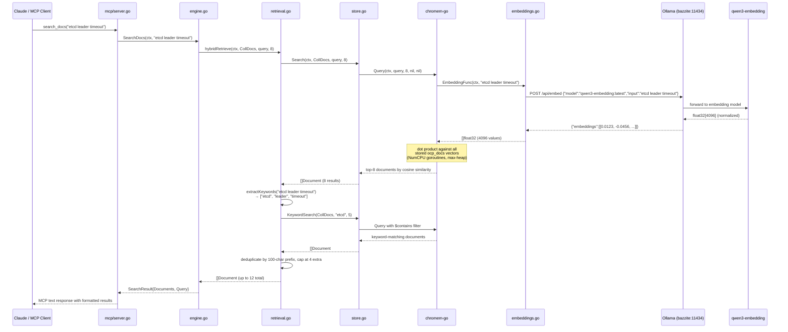

# Embedding Models in the RAG+MCP Pipeline

## 1. Why Embedding Models Are Required for RAG

Retrieval-Augmented Generation depends on **semantic search**: given a natural-language query, find the most relevant documents from a corpus of tens of thousands. This requires a mathematical representation of "meaning" that supports a computable distance metric.

An embedding model maps arbitrary text to a **fixed-dimension dense vector** of float32 values, where geometric proximity (cosine similarity) corresponds to semantic similarity. Two passages about "etcd leader election timeout" will land near each other in vector space even if they share no exact keywords.

This is fundamentally different from what a generative LLM does. A generative model performs **next-token prediction**: given an input sequence, it produces a probability distribution over vocabulary tokens for the next position. Its output is a token sequence, not a point in a metric space. There is no single vector that captures the "meaning" of the entire input.

The RAG pipeline requires embeddings at two points:

1. **Ingestion time** (offline): every document chunk is embedded and stored as a normalized float32 vector alongside its text content.
2. **Query time** (online): the user's query is embedded using the *same model*, producing a vector of *identical dimension*.

The cosine similarity between the query vector and each stored document vector ranks relevance. This is only well-defined when both vectors have the same dimensionality. Mixing a 384-dim query vector with 4096-dim document vectors is a type error, not a degradation.

### The Contrastive Training Objective

Embedding models achieve this property through **contrastive learning**. During training, the model is shown pairs of texts: positive pairs (semantically related) and negative pairs (unrelated). The loss function (typically InfoNCE) pushes positive pairs closer together and negative pairs apart in vector space.

This is categorically different from the cross-entropy loss used to train generative LLMs, which optimizes for predicting the next token given preceding context.

```
Contrastive loss (embedding model):
  minimize  distance(embed("etcd timeout"), embed("etcd leader election failed"))
  maximize  distance(embed("etcd timeout"), embed("SR-IOV VF configuration"))

Cross-entropy loss (generative model):
  maximize  P(next_token | preceding_tokens)
```

The result: an embedding model produces vectors where cosine similarity is a meaningful semantic distance. A generative model's internal hidden states are optimized for token prediction and carry no such guarantee.

## 2. Encoder-Only vs Decoder-Only Transformer Architecture

The architectural distinction between embedding models and generative LLMs maps directly to the transformer attention mechanism.

### Decoder-Only (ornith:35b, llama3, qwen3 generative)

Decoder-only models use a **causal attention mask**: each token can only attend to itself and preceding tokens. This enables autoregressive generation (each new token is conditioned on all previously generated tokens) but means the model never has a complete bidirectional view of the input.

```
Causal attention mask (decoder-only):

Token:     [The]  [etcd]  [leader]  [timed]  [out]
  The       1      0       0         0        0
  etcd      1      1       0         0        0
  leader    1      1       1         0        0
  timed     1      1       1         1        0
  out       1      1       1         1        1

Each token only sees tokens to its left. The final token's hidden state
is biased toward end-of-sequence context. This is optimized for generation,
not for producing a holistic semantic representation of the entire input.
```

The output of a decoder-only model is a vocabulary-sized logit vector at each position, from which the next token is sampled. There is no natural "embedding output" — Ollama's `/api/embed` endpoint returns HTTP 501 when called on these models because they have no dedicated embedding extraction path.

### Bidirectional Encoder (qwen3-embedding)

Embedding models use **full bidirectional attention**: every token attends to every other token in the input. This allows the model to build a representation that considers the entire context simultaneously.

```
Full attention mask (encoder/embedding model):

Token:     [The]  [etcd]  [leader]  [timed]  [out]  [EOS]
  The       1      1       1         1        1      1
  etcd      1      1       1         1        1      1
  leader    1      1       1         1        1      1
  timed     1      1       1         1        1      1
  out       1      1       1         1        1      1
  EOS       1      1       1         1        1      1

Every token sees every other token. The [EOS] hidden state captures
a holistic representation of the entire input sequence.
```

The embedding vector is extracted from the **hidden state of the final [EOS] token**, which has attended to every other token in the input. This is the semantic fingerprint of the entire passage.

### Qwen3-Embedding Specifics

Qwen3-embedding is built on the Qwen3 foundation model backbone, available in 0.6B, 4B, and 8B parameter sizes. It uses LoRA fine-tuning on the base Qwen3 model to preserve its text understanding capabilities while adding embedding-specific behavior.

**Training pipeline** (three-stage):

| Stage | Method | Data |
|-------|--------|------|
| 1. Contrastive pre-training | InfoNCE loss with multi-task prompt system | Weakly supervised text pairs generated by Qwen3 itself |
| 2. Supervised fine-tuning | Contrastive loss on labeled data | High-quality curated text similarity pairs |
| 3. (Optional) Task-specific | Instruction-prefixed embeddings | Domain-specific retrieval pairs |

**Key properties:**
- Output dimensions: configurable from 32 to 1,024 (default via Ollama: 4096 with the `latest` tag)
- Language support: 100+ languages (inherited from Qwen3 tokenizer, 151,669 BPE vocabulary)
- MTEB multilingual leaderboard: #1 for 8B size (score 70.58, June 2025)
- Tokenizer: byte-level byte-pair encoding (BBPE)

**ornith:35b**, by contrast, is a 35-billion parameter decoder-only generative model. It is designed for text generation, instruction following, and reasoning tasks. It has no contrastive training stage, no [EOS] extraction mechanism, and no fixed-dimension output. It cannot produce embeddings.

## 3. The Embedding Pipeline in This Codebase

The embedding pipeline connects four Go packages: the Ollama HTTP client, the chromem-go vector store, the hybrid retrieval engine, and the MCP server layer.

### 3.1 Embedding Function (`internal/rag/embeddings.go`)

The entry point is `NewOllamaEmbedder()` at `embeddings.go:16`, which returns an `EmbeddingFunc` closure:

```go
type EmbeddingFunc func(ctx context.Context, text string) ([]float32, error)
```

The closure probes Ollama's API on first invocation and caches the working endpoint in `resolvedEndpoint` (`embeddings.go:22`):

- **`/api/embed`** (Ollama >= 0.4): request `{"model": "...", "input": text}`, response `{"embeddings": [[float32...]]}`
- **`/api/embeddings`** (legacy): request `{"model": "...", "prompt": text}`, response `{"embedding": [float32...]}`

Both formats are handled by `callEmbedEndpoint()` (`embeddings.go:54`), which marshals the appropriate request body based on the URL suffix and decodes whichever response field is populated.

If both endpoints fail, the error at `embeddings.go:41` provides explicit guidance:

```
ollama at http://bazzite:11434 does not support embeddings for model "ornith:35b".
  Fix: pull an embedding model and use it in rag-config.yaml:
    ollama pull all-minilm        # 384-dim, fast, recommended
    ollama pull nomic-embed-text   # 768-dim, higher quality
    ollama pull mxbai-embed-large  # 1024-dim, best quality
  Note: generative LLMs (llama3, qwen3, etc.) cannot produce embeddings.
```

### 3.2 Vector Storage (`internal/rag/store.go`)

`NewStore()` at `store.go:19` creates a persistent chromem-go database and initializes five collections:

```go
for _, name := range AllCollections {
    coll, err := db.GetOrCreateCollection(string(name), nil, chromemEmbed)
    // ...
}
```

The `chromemEmbed` function (the `EmbeddingFunc` from section 3.1, cast to `chromem.EmbeddingFunc`) is passed to each collection. chromem-go uses it for both ingestion and query-time embedding.

**On `AddDocuments()`** (`store.go:51`): chromem-go calls the embedding function for each document's content text. The returned float32 vector is L2-normalized (divided by its Euclidean norm to unit length) and stored alongside the raw text and metadata. The concurrency parameter is 4 (`store.go:70`), meaning 4 concurrent embedding HTTP calls per batch.

**On `Query()`** (`store.go:73`): chromem-go embeds the query string using the same `EmbeddingFunc`, producing a vector of identical dimension. It then computes **cosine similarity** against every stored vector in the collection. Because both vectors are pre-normalized, cosine similarity reduces to a dot product:

```
cosine_similarity(a, b) = dot(a, b) / (||a|| * ||b||)

When ||a|| = ||b|| = 1 (pre-normalized):
cosine_similarity(a, b) = dot(a, b) = sum(a[i] * b[i] for i in 0..dim-1)
```

chromem-go parallelizes this computation across `runtime.NumCPU()` goroutines, each processing a slice of the document vectors. Results are collected into a max-heap, and the top-K documents are returned.

### 3.3 Hybrid Retrieval (`internal/rag/retrieval.go`)

`hybridRetrieve()` at `retrieval.go:9` combines semantic vector search with keyword supplementation:

1. **Semantic search**: `store.Search()` returns the top-K documents by cosine similarity
2. **Keyword extraction**: `extractKeywords()` (`retrieval.go:61`) splits the query into words >= `KeywordMinLength` (default 4) characters, removes 40+ stop words
3. **Keyword supplement**: for the top 2 extracted keywords, `store.KeywordSearch()` finds documents whose content contains the keyword verbatim. Up to `KeywordSupplementMax` (default 4) additional documents are appended, deduplicated by 100-character content prefix

This hybrid approach catches documents that are lexically relevant but may not rank highly in pure semantic search (e.g., exact operator names, error codes, configuration keys).

### 3.4 Engine Orchestration (`internal/rag/engine.go`)

`NewEngine()` at `engine.go:15` wires the embedding function into the store:

```go
embedFunc := NewOllamaEmbedder(cfg.Embedding.URL, cfg.Embedding.Model)
store, err := NewStore(cfg.ChromemDir(), EmbeddingFunc(embedFunc))
```

`Troubleshoot()` at `engine.go:32` performs **parallel multi-collection search** using a `sync.WaitGroup` with 4 goroutines:

| Collection | Top-K | Method |
|------------|-------|--------|
| `ocp_docs` | 8 | Hybrid (semantic + keyword) |
| `operator_code` | 6 | Hybrid (semantic + keyword) |
| `telco_configs` | 4 | Semantic only |
| `known_issues` | 5 | Semantic only |

Each goroutine independently embeds the query (via the shared `EmbeddingFunc`) and searches its collection. The embedding model is called 4-6 times per `Troubleshoot()` invocation (4 semantic queries + up to 2 keyword supplements per hybrid collection).

### 3.5 MCP Server (`internal/rag/mcp/server.go`)

The MCP server exposes 8 tools via `mcp-go` stdio transport. Each tool handler calls the engine, which triggers the embedding pipeline. For example, `handleSearchDocs()` at `mcp/server.go:107`:

```
Claude tool call → MCP JSON-RPC → handleSearchDocs()
  → engine.SearchDocs() → hybridRetrieve()
    → store.Search() → chromem.Query() → EmbeddingFunc(query)
      → HTTP POST bazzite:11434/api/embed → qwen3-embedding → float32[4096]
    → dot product across all stored ocp_docs vectors
    → top-8 by cosine similarity + up to 4 keyword supplements
  → SearchResult → MCP text response
```

## 4. Why ornith:35b Failed

When `rag-config.yaml` specified `model: "ornith:35b"`, the ingestion pipeline failed at the first `AddDocuments()` call. The failure chain:

1. `store.go:70` — `c.AddDocuments(ctx, chromemDocs, 4)` triggers chromem-go to embed each document
2. chromem-go calls `EmbeddingFunc(ctx, doc.Content)` which is the `NewOllamaEmbedder()` closure
3. The closure POSTs to `bazzite:11434/api/embed` with `{"model": "ornith:35b", "input": "..."}`
4. Ollama's embedding dispatcher checks if the model supports embedding extraction
5. `ornith:35b` is a decoder-only generative model with no embedding output layer
6. Ollama returns **HTTP 501** with body: `"This server does not support embeddings. Start it with --embeddings"`
7. `callEmbedEndpoint()` at `embeddings.go:80` wraps this as an error: `"ollama embed: status 501: ..."`
8. The closure falls through to the `/api/embeddings` endpoint, which returns the same 501
9. `isEmbeddingNotSupported()` at `embeddings.go:104` matches `"status 501"` and `"does not support embeddings"`
10. The closure returns the diagnostic error from `embeddings.go:41`

This is not a configuration issue or a version incompatibility. It is an **architectural impossibility**: a decoder-only autoregressive model has no mechanism to produce a fixed-dimension semantic vector. The Ollama server correctly refuses the request.

## 5. End-to-End Data Flow



## 6. Embedding Model Comparison and Compatibility

### Model Comparison

| Property | qwen3-embedding:latest | ornith:35b |
|----------|----------------------|------------|
| **Architecture** | Bidirectional encoder (Qwen3 backbone + LoRA) | Decoder-only (causal attention) |
| **Training objective** | Contrastive loss (InfoNCE) | Cross-entropy (next-token prediction) |
| **Output** | Fixed-dimension float32 vector | Token probability distribution |
| **Parameters** | 0.6B / 4B / 8B | 35B |
| **Output dimensions** | 32-4096 (configurable) | N/A (no embedding output) |
| **Ollama /api/embed** | 200 OK with embeddings | 501 Not Supported |
| **Suitable for RAG** | Yes | No |
| **Suitable for generation** | No (no decoding head) | Yes |

### Dimension Trade-offs

The choice of embedding dimension directly affects storage cost, search latency, and semantic resolution:

| Model | Dimensions | Storage per vector | Relative search cost | Quality (MTEB) |
|-------|-----------|-------------------|---------------------|----------------|
| all-minilm | 384 | 1.5 KB | 1x (baseline) | Moderate |
| nomic-embed-text | 768 | 3 KB | 2x | Good |
| mxbai-embed-large | 1024 | 4 KB | 2.7x | Very good |
| qwen3-embedding | 4096 | 16 KB | 10.7x | Excellent (#1 MTEB multilingual) |

chromem-go uses brute-force exhaustive search (no index structure like HNSW or IVF). Search cost scales linearly with both vector count and dimension. For 44,255 documents at 4096 dimensions, each query computes ~181 million float32 multiplications (44,255 * 4,096). This is parallelized across `NumCPU` goroutines but remains CPU-bound.

### The Dimension Constraint

Document vectors and query vectors **must have identical dimensions**. The dimension is determined by the embedding model at ingestion time and baked into every stored vector. Changing the embedding model (e.g., from `all-minilm` at 384d to `qwen3-embedding` at 4096d) requires a **full re-ingestion** of all 44,255 documents.

If a dimension mismatch occurs at query time (different model used for querying than for ingestion), the dot-product computation will either panic on out-of-bounds access or produce meaningless similarity scores.

The current configuration in `rag-config.yaml`:

```yaml
embedding:
  url: "http://bazzite:11434"
  model: "qwen3-embedding:latest"
```

All five collections (`ocp_docs`, `operator_code`, `telco_configs`, `known_issues`, `manifests`) are embedded with `qwen3-embedding:latest`, producing 4096-dimensional vectors persisted in the `rag-data/chromem/` directory.

## References

- [Qwen3 Embedding blog post](https://qwen.ai/blog?id=qwen3-embedding)
- [Qwen3 Embedding GitHub](https://github.com/QwenLM/Qwen3-Embedding)
- [Qwen3 Embedding Technical Report (arXiv:2506.05176)](https://arxiv.org/abs/2506.05176)
- [Qwen3 Technical Report (arXiv:2505.09388)](https://arxiv.org/abs/2505.09388)
- [chromem-go](https://github.com/philippgille/chromem-go)
- [mcp-go](https://github.com/mark3labs/mcp-go)
